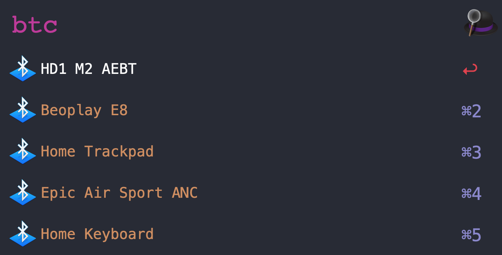
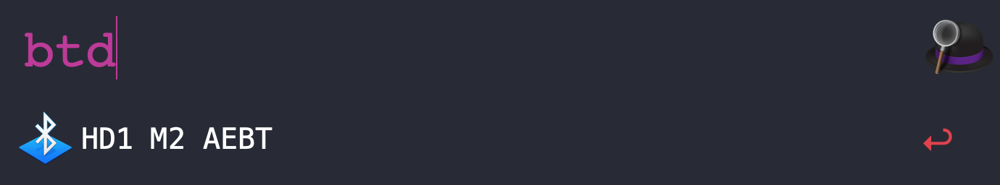

# Alfred workflow to connect and disconnect a BT device

Connect and disconnect a paired bluetooth device.

Tested with macOS Monterey and Alfred 4.8

## Usage
- `btc` - lists all paired devices, select a device and hit ENTER to connect.


- `btd` - lists all connected devices, select a device and hit ENTER to disconnect.


## Installation
- Download the workflow from the root folder, or [click here](https://github.com/davidraviv/alfred-bt-connection/raw/main/Bluetooth%20device%20connection.alfredworkflow)
- Double click the downloaded file to install the workflow.

## Use cases
I use it to disconnect my bluetooth headset when I'm receiving a phone call and connect it back when the call is over.

## Who is Alfred??
Alfred an awesome productivity app for macOS. You can find more information about Alfred [here](https://www.alfredapp.com/)

## Dependencies
[Blueutil](https://github.com/toy/blueutil) - CLI for bluetooth on OSX

Installing using brew:
```
brew install blueutil
```